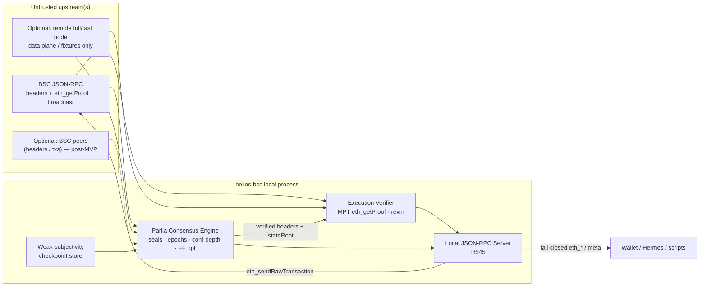

# Helios-like Trust-Minimized Light Client for BNB Smart Chain (BSC)

| Field | Value |
|-------|-------|
| **Document** | BSC Verified Local JSON-RPC (Parlia Light Client) |
| **Author** | ConnectionServers / bigdaddy ops (placeholder) |
| **Date** | 2026-08-18 |
| **Status** | **Active development** — Phase 0 / scaffold in `ConnectionServers/helios-bsc` (rev 5 design + PR1 scaffold) |
| **Working name** | **helios-bsc** (crate/binary: `helios-bsc`; product name TBD) |
| **License** | Dual Apache-2.0 OR MIT |
| **Repo home (decided)** | Independent public repo `helios-bsc` (not inside a16z/helios); developed under `ConnectionServers/helios-bsc/` |
| **Canonical docs** | This tree: `helios-bsc/docs/` (stubs in `agent-workspace/` point here) |

---

## Overview

Operators want wallet-like JSON-RPC on BNB Smart Chain—balances, `eth_call`, raw tx broadcast—without running a multi-terabyte BSC full/fast node and without blindly trusting centralized RPC providers. Ethereum already has a16z **Helios**: a Rust light client that syncs in seconds with ~0 durable storage by verifying beacon sync-committee signatures and checking execution-layer Merkle proofs (`eth_getProof`) against a consensus-verified `stateRoot`.

**BSC does not have Ethereum sync committees.** Consensus is **Parlia** (Proof of Staked Authority): **~45 elected active validators** (21 Cabinet + 24 Candidates), of which **21 consensus validators seal blocks each epoch** (typically 18 Cabinet + 3 Candidates). Sealers use ECDSA (Clique-like `extraData`), embed the next validator set in **epoch headers**, and (post-Plato) may add **Fast Finality** BLS votes. A Helios-like product for BSC is therefore **not** a thin config fork of Helios Ethereum consensus; it is a **greenfield Parlia light-client path** that reuses Helios *patterns* and shared execution-proof machinery (Alloy / revm / MPT verification), while implementing Parlia header, epoch, and finality verification from first principles.

This document proposes an open-source Rust binary that (1) maintains a minimal verified view of Parlia headers / validator set / finality, (2) serves a local JSON-RPC (`:8545`-style) that **cryptographically verifies** account and storage results against a verified `stateRoot`, and (3) clearly labels methods as **verified**, **unverified passthrough**, or **unsupported**. Upstream RPCs remain required as *data sources*; trust in them is minimized by verification, not eliminated as a networking dependency.

**MVP split:** **MVP-1** = seals + epochs + confirmation-depth + verified state reads (no FF dependency). **MVP-2** = Fast Finality when Phase 0 proves public RPC vote data is verifiable. **Demo Slice** = thinnest vertical (checkpoint → seals → epoch delay → confirmation-depth → verified `eth_getBalance`) as the first staffing reality check.

This is a **long R&D / open-source track** (~**9–18 months** at 1–2 engineers part-time unless closer to 1 FTE), not a weekend deploy on `pxmx_main`.

---

## Background & Motivation

### Operator / infra context

ConnectionServers runs **bigdaddy** (`pxmx_main`): Proxmox host with AI stack on `/mnt/usbssd` and Bitcoin full node **CT201** on SMART-degraded `/mnt/big` (~2 TB HDD, IBD in progress). Per `inventory/hosts.md` storage table: `/mnt/fast` (WD 1TB) is a free spare and is the **preferred optional deploy disk** for helios-bsc if/when packaged—avoid contending with AI on usbssd and **never** use `/mnt/big`. Disk pressure makes a second multi-TB chain incompatible with the “weighs nothing / share host with BTC” goal.

BSC storage reality (motivation, not a deploy plan): **full/fast** nodes typically need **≥2–3 TB SSD**; **archive** is much larger (multi-TB beyond that). Either way unfit for `/mnt/big` beside CT201.

**Operator conversation context (not inventory-evidenced):** BCH full node deferred to a future disk. Desired capability is **ETH / BNB / SOL wallet-like ops** with minimized RPC trust; **BNB Helios-like is phase 1 (this doc)**; SOL is phase 2 (Tinydancer reportedly stalled ~May 2026) and out of MVP scope.

Operator crypto workflows already live under `agent-workspace/crypto-reports/` (risk stubs, balance probes). A future copy of this design may live under `agent-workspace/designs/` or `crypto-reports/`; **this deliverable does not require changing production BTC or AI stacks**.

### Current state / pain points

| Approach today | Pain |
|----------------|------|
| Public BSC RPC (Ankr, NodeReal, QuickNode, etc.) | Blind trust for balances, nonces, call results; eclipse / lying RPC risk |
| Self-hosted BSC full/fast node | ≥2–3 TB SSD (archive ≫); IOPS/bandwidth; competes with BTC IBD and degraded disk |
| MetaMask / wallet defaults | Same as public RPC; no local verification |
| ETH Helios | Exists and works; **not** applicable to Parlia consensus as-is |

### Why Helios does not port cleanly

Helios Ethereum:

1. **Consensus light client** — Altair sync protocol: 512 randomly selected sync-committee validators, ~27-hour periods, aggregated **BLS** signatures over beacon headers; weak subjectivity checkpoint as root of trust. Sync can advance by verifying committee updates without walking every execution header.
2. **Execution verification** — Untrusted execution RPC supplies `eth_getProof`; Helios verifies account/storage Merkle Patricia proofs against the `stateRoot` embedded in a consensus-verified execution payload / header.
3. **Local RPC** — Serves verified `eth_*` subset on `127.0.0.1:8545`.

BSC Parlia:

1. **No sync committees**, no Beacon API light-client endpoints, no Altair sync protocol—and therefore **no period-skipping sync**. The light client must **parent-link walk and verify ECDSA seals** from checkpoint to head.
2. **Elected pool vs sealing set:** ~**45 elected active** validators (21 Cabinet + 24 Candidates); each epoch only **N_seal ≈ 21 consensus validators** produce/seal blocks (typically 18 Cabinet + 3 Candidates). Confirmation-depth math uses **N_seal**, not 45.
3. **Epoch blocks** embed the validator set in `extraData` for light clients. **Current mainnet epoch length = 1000 blocks (post-Maxwell)**; historical values include 200 then 500—treat those as legacy only. Activation of the new set is **delayed by N_seal/2 blocks** so a single dishonest epoch sealer cannot immediately rewrite the light-client view without subsequent seals.
4. **Validator set source of truth** for full nodes is system contract `BSCValidatorSet` at `0x000…1000`; light clients cannot re-execute that contract continuously without state proofs—they rely on epoch `extraData` plus the delay rule.
5. **Fast Finality** (Plato / BEP-126+) adds BLS vote aggregation aiming for ~1s finality when ≥⅔ of the **vote/consensus set** vote (`ceil(2×N_vote/3)` / BEP-126). Public JSON-RPC exposure of verifiable aggregates is **unproven for MVP**—see MVP-1 vs MVP-2. Fallback: probabilistic confirmations waiting for **>⅔ distinct ECDSA sealers** from the epoch sealing set (**`floor(2×N_seal/3)+1`**, e.g. **15 for N_seal=21**).

Honest conclusion: **execution-proof reuse is high; consensus path is a new Parlia module; sync cost is fundamentally different from Helios.**

---

## Goals & Non-Goals

### Goals

#### Demo Slice (first demoable milestone — ~3–4 months part-time)

1. Checkpoint → verify Parlia seals → epoch transitions with N/2 delay → confirmation-depth safe head.
2. Serve verified `eth_getBalance` (and ideally nonce) fail-closed against verified `stateRoot`.
3. Prove Phase 0 exit gates (hardfork pins + ≥1 **hash/number** `eth_getProof` path or Alt F—not tag-only).

#### MVP-1 (wallet-useful without Fast Finality)

1. Sync a **Parlia light consensus view** (headers, sealing validator set, confirmation-depth finality) with **minimal durable disk**.
2. Verified: `eth_getBalance`, `eth_getTransactionCount`, `eth_getCode`, `eth_getStorageAt`, `eth_chainId`, `eth_blockNumber`; unverified broadcast `eth_sendRawTransaction`.
3. Explicit **verified | unverified | unsupported** policy; default fail-closed (hard RPC errors for MetaMask-compatible clients).
4. Run on commodity hardware / small LXC alongside BTC **without** using `/mnt/big`.
5. Open-source Rust; Apache-2.0 OR MIT; documented threat model and checkpoint UX.
6. Depend on ≥1 upstream for headers/proofs but **detect lies** that break seal / proof rules.

#### MVP-2 (after Demo Slice / when data available)

7. Fast Finality BLS verification when Phase 0 fixtures prove RPC fields suffice.
8. Constrained `eth_call` / best-effort `eth_estimateGas` (historically large; deferred past Demo Slice).

### Non-Goals (explicit)

| Non-goal | Reason |
|----------|--------|
| Solana light client / Tinydancer | Phase 2; out of MVP |
| Archive history, `eth_getLogs` over deep ranges, indexer replacement | Storage & trust model incompatible with “~0 storage” |
| MEV / block building / validator ops | Different product |
| Replacing full nodes for explorers, subgraphs, or compliance archives | Light client ≠ archive |
| Trustless P2P Portal Network for BSC | Does not exist as ETH Portal equivalent; future research |
| opBNB as substitute for BSC L1 verification | opBNB is OP-Stack L2; Helios `opstack` path verifies L2 *relative to L1*—does not give BSC L1 Parlia light sync |
| Changing Bitcoin CT201 or AI stack layout | Infra note only; optional later deploy |
| WASM wallet embed in MVP | Nice-to-have post-MVP; design for library-friendly crates |
| Shipping FF as a blocker for first verified balances | MVP-1 uses confirmation-depth only |

---

## Acceptance Criteria

### Demo Slice DoD

- [x] Multisource checkpoint ≤ **24h** old (default policy) accepted by CLI.
- [x] Client walks/verifies headers to head; reports `helios_bsc_syncStatus` with confirmation-depth mode, N_seal-derived threshold, and **`safe_lag_blocks` / `safe_lag_seconds`**.
- [x] MetaMask-style `eth_getBalance(addr, "latest")` **succeeds** once a Safe head exists (default wallet mode maps `latest` → Safe), using proofs fetched by **Safe block hash/number** (not tag-only upstream).
- [x] `eth_blockNumber` returns **Safe** height in default wallet mode (consistent with `latest`→Safe for balances).
- [x] For **≥10** mainnet addresses, local verified `eth_getBalance` matches an **independent** differential oracle (≠ sole proof/header upstream). Live 2026-08-19: **19 unique / 214 compared / 0 mismatch** (Ankr proofs, BlastAPI oracle) over a **≥1h** re-diff soak. 24h soak remains before GA.
- [x] Zero silent unverified passthrough on supported methods (CI adversarial mock).
- [x] Phase 0 exit checklist complete: hardfork table pinned; proof matrix row with ≥1 **hash/number or Alt F** path (tag-only **does not** count for Demo Slice); modern epoch-boundary fixtures. **Partial** on Ankr number proofs (knife-edge vs Safe lag).

### MVP-1 DoD

- [ ] All Demo Slice criteria, plus verified nonce/code/storageAt; `eth_sendRawTransaction` labeled unverified; unsupported methods hard-error by default.
- [ ] Mainnet differential soak **≥24h** with zero proof false-accepts; oracle **independent** of the sole upstream used for proofs/headers (second RPC, explorer API, or second Alt F).
- [ ] Checkpoint age / sync lag SLOs documented and met under default freshness policy.
- [ ] Docs: threat model, RPC matrix, checkpointing, incident stub for proof-fail storms.

### MVP-2 DoD (optional track)

- [ ] FF verification feature-flagged; enabled only when fixtures + live RPC expose verifiable aggregates.
- [ ] Constrained `eth_call` with gas/proof budgets; estimateGas explicitly best-effort.

---

## Proposed Design

### High-level architecture



### Helios ETH vs BSC Parlia (comparison)

| Dimension | Helios (ETH) | helios-bsc (proposed) |
|-----------|--------------|------------------------|
| Consensus root of trust | Weak subjectivity beacon checkpoint | Weak subjectivity **Parlia checkpoint** (block hash + number + **sealing** validator set) |
| Ongoing consensus proof | Sync committee BLS (≥⅔ of 512) | Header **ECDSA seals** by epoch **sealing set (N_seal≈21)** + optional FF BLS (MVP-2) |
| Committee size / churn | 512 random, ~27h | **45 elected** / **21 seal per epoch**; epoch length **1000** blocks post-Maxwell; N_seal/2 activation delay |
| Consensus data API | Beacon light-client REST | Standard `eth_getBlockByNumber/Hash` (+ FF fields when available — MVP-2) |
| Execution proofs | `eth_getProof` vs verified `stateRoot` | Same pattern; **Demo Slice requires hash/number proofs or Alt F** (tag-only insufficient for Safe lag) |
| Finality | Beacon finalized checkpoints | **MVP-1:** confirmation-depth **`floor(2×N_seal/3)+1`** distinct sealers (=15 for 21; ~1–2 min lag @ turnLength≈16). **MVP-2:** FF when verifiable |
| Sync time target | Seconds (committee skip) | **After a fresh checkpoint (hours–≤24h default):** minutes–tens of minutes with batched fetch. **Not** “seconds from a week-old checkpoint” |
| Durable storage | Latest checkpoint (~32 B+) | Checkpoint + last headers / validator snapshot (KB–few MB) |

### Hardfork / network config table (normative pins — Phase 0 freezes exact values)

`helios-bsc-config` must ship a fork-aware table keyed by block/time, pinned to a specific `bnb-chain/bsc` commit. Illustrative mainnet values (verify in Phase 0; do not implement from memory alone):

| Era / hardfork | Epoch length | turnLength (approx) | Block interval | Notes for light client |
|----------------|--------------|---------------------|----------------|------------------------|
| Historical (early Parlia / Coinskite-era docs) | **200** | — | ~3–5s class | **Legacy only** — fixtures may include for codec tests |
| Pre-Maxwell intermediate | **500** | 8 | shorter intervals | Legacy |
| **Maxwell+ (current baseline)** | **1000** | 16 | pre-Fermi interval | **Normative epoch length for mainnet design** |
| **Fermi (Jan 2026)** | 1000 (confirm) | confirm | **0.45s** | Dominates sync-cost math |
| Luban / Plato / Bohr / Lorentz / … | per release | per release | per release | `extraData` / vote-key / FF field layout versions |

**Implementation rule:** Do **not** hard-code 200 in consensus logic. Read `epochLength` / `turnLength` / `extraDataVersion` from config at the block height being verified.

### Validator sets: elected 45 vs sealing 21

| Term | Meaning | Used for |
|------|---------|----------|
| **Elected active set (~45)** | 21 Cabinet + 24 Candidates (governance/election) | Who *can* enter the sealing set; contract views |
| **Epoch consensus / sealing set (N_seal ≈ 21)** | Validators that produce and ECDSA-seal blocks this epoch (typically 18 Cabinet + 3 Candidates) | Seal verification; confirmation-depth threshold; N/2 epoch-delay denominator |
| **FF vote set** | Validators with vote/BLS keys participating in Fast Finality | MVP-2 only; Phase 0 must confirm whether vote N equals N_seal |

**Confirmation-depth threshold (MVP-1) — strictly more than ⅔:**

```text
min_distinct_sealers := floor(2 * N_seal / 3) + 1
# N_seal = 21 → floor(14)+1 = 15
# Do NOT use ceil(2N/3)+1 in general (off-by-one when 2N/3 is non-integral; e.g. N=22).
```

| N_seal | floor(2N/3)+1 (>⅔) | ceil(2N/3) (≥⅔, FF-style) | ceil(2N/3)+1 (incorrect general “>⅔”) |
|--------|--------------------|---------------------------|----------------------------------------|
| 21 | **15** | 14 | 15 (coincidentally OK) |
| 22 | **15** | 15 | 16 (too strict) |
| 45 | **31** | 30 | 31 (coincidentally OK) |

Unit-test this table in consensus tests (config-driven N; OQ7). CLI derives `min_distinct_sealers` from the active sealing snapshot; do **not** ship a hardcoded 31 as if N were the elected pool of 45.

**Expected Safe confirmation latency (operator UX):** with Maxwell-era **`turnLength≈16`**, a new distinct in-turn sealer appears only about every `turnLength` blocks in the happy path. Wall-clock Safe lag is therefore on the order of:

```text
safe_lag_blocks ≈ O(min_distinct_sealers × turnLength)   # ~15 × 16 ≈ 240 blocks
safe_lag_seconds ≈ safe_lag_blocks × blockInterval         # ~240 × 0.45s ≈ ~108s → ~1–2 minutes
```

This is **not** “15 blocks” and **not** Fast Finality’s ~1s. Expose `safe_lag_blocks` / `safe_lag_seconds` on `helios_bsc_syncStatus`. Default “stale head” alerts must sit **above** this floor (e.g. warn if tip lag ≫ Safe lag, not if Safe is 90s behind tip). Hermes / wallet timeouts should allow ≥2–3 minutes for first Safe after cold sync catch-up.

### Consensus verification path (Parlia light client)

#### Root of trust: weak subjectivity checkpoint

On first run (or forced), the operator supplies or selects a **checkpoint**:

```text
checkpoint := {
  block_number,
  block_hash,
  state_root,          // recommended
  sealing_validator_set,  // N_seal consensus addresses for this epoch
  vote_keys,           // optional; required only if FF enabled
  epoch_number,
  fork_id / config_hash,
  sourced_from,        // "manual" | "multisource-majority" | …
  created_at
}
```

**Security note (parity with Helios):** A malicious checkpoint syncs the client to the wrong chain. Mitigations:

- Prefer checkpoints within **MVP max age driven by header-walk cost**: default **≤24 hours** (configurable; soft warn >6h; hard fail default >24h under `--strict-checkpoint-age`). The old “7–14 days like Helios” window is **unsafe as a UX default here**—see Sync performance.
- Cross-check hash/number/`stateRoot` across **≥2 independent sources** (explorers + RPCs) before accept (`--require-multisource-checkpoint`).
- Persist last verified safe/finalized header as next start checkpoint (Helios pattern)—**this is what makes day-2 sync cheap**.
- Document that community checkpoint lists are **best-effort**, not a security oracle.

#### Sync performance (critical — not Helios-like)

Unlike Helios (Altair sync committees allow advancing via aggregated BLS without verifying every intermediate execution header), a Parlia light client must **walk parent-linked headers and verify each ECDSA seal** from checkpoint → head.

| Checkpoint age | Approx headers @ 0.45s/block | Implication |
|----------------|------------------------------|-------------|
| 1 hour | ~8,000 | Feasible with batched RPC (seconds–few minutes) |
| 24 hours | ~192,000 | Tens of minutes–low hours depending on batching/rate limits; MVP upper bound for default strict age |
| 7 days | ~1.3M | Poor UX; hammer upstreams; **not** default |
| 14 days | ~2.7M | Unsuitable for “quick sync” narrative |

**MVP sync strategy:**

1. **Mandate fresh checkpoints** + auto-persist `last_finalized` / `last_safe` so restarts are incremental.
2. **Batched / parallel header download** — standard `eth_getBlockByNumber` takes a **single** block id; there is **no** portable range RPC. Batching means **JSON-RPC batch arrays** (array of `eth_getBlockByNumber` calls) and/or **bounded parallel** single-block requests (configurable concurrency; backoff on 429). Do not rely on a non-standard `eth_getBlockRange`.
3. **Target throughput (aspirational):** ≥500–2000 header verifies/sec CPU-bound locally once fetched; wall-clock dominated by RPC. RSS budget **&lt;256 MB** typical with bounded header cache.
4. **No sampling / skipping headers** for security-critical sync—parent hash + seal integrity require the chain. (Research-only: skip non-epoch bodies when full tx roots unused—still need every **header**.)
5. Gate marketing language: **“seconds–low minutes after a recent (≤1h) checkpoint”**; **“minutes–tens of minutes after ≤24h”**; never claim Helios-like sync from week-old roots.

```mermaid
sequenceDiagram
  participant Op as Operator
  participant LC as helios-bsc
  participant RPC as Upstream RPC

  Op->>LC: Start with fresh checkpoint C (≤24h)
  LC->>RPC: JSON-RPC batch / parallel eth_getBlockByNumber (per height)
  loop Each header
    LC->>LC: Verify parent, seal vs N_seal set, epoch rules
    LC->>LC: Accumulate distinct sealers (MVP-1)
  end
  LC->>LC: Mark safe head when distinct sealers ≥ floor(2N/3)+1
  Op->>LC: eth_getBalance(addr, "latest") / eth_blockNumber
  Note over Op,LC: wallet mode maps both to Safe
  LC->>RPC: eth_getProof(addr, [], Safe blockHash or number)
  Note over LC,RPC: Tag-only latest/finalized ≠ Safe (~240 blk lag); need hash/number or Alt F
  LC->>LC: Reject if proof stateRoot ≠ local Safe stateRoot
  LC->>LC: Verify MPT proof
  LC-->>Op: balance + Safe height OR hard error
```

#### Header verification (per block)

For each new header `H` extending the verified chain:

1. **Structural checks** — parent hash links; number = parent+1; timestamp monotonic / within Parlia backoff rules for out-of-turn sealers; gas limits; `extraData` length rules for the **fork-active `extraDataVersion`**.
2. **Seal verification** — Parse `extraData` per versioned codec (Phase 0 normative appendix / vectors). Recover signer from `Keccak256(RLP(header_without_seal))` + 65-byte seal; require signer ∈ **current sealing set**; difficulty / in-turn vs out-of-turn per Parlia (see Implementation specificity).
3. **Epoch transitions** — At height `% epochLength == 0` (config), extract embedded validator set bytes; schedule activation at **epochBoundary + N_seal/2**. Do **not** trust a lone epoch header until confirmation-depth policy is met on the branch.
4. **Fork choice (MVP-1 — deliberately simple):**
   - Default: **strict linear extension** from checkpoint; accept a reorg only within **`max_reorg_depth = N_seal` blocks** (for N_seal=21 → **≤21**), preferring the branch with higher cumulative in-turn difficulty sum as defined in `parlia.go` (`CalcDifficulty` / snapshot scoring)—exact function names pinned in Phase 0 appendix.
   - Reject headers that violate backoff / future timestamps.
   - Full GHOST-like exploration is **out of MVP-1**; document limitation.
5. **Fast Finality (MVP-2 only, feature-flagged)** — If header/RPC exposes FF vote bitfield + aggregated BLS signature, verify against known vote pubkeys; mark `finalized` when ≥⅔ of **vote set** verify. If FF data absent, **do not block**—confirmation-depth remains the safe path for MVP-1 reads.

#### Implementation specificity gate (do not invent seals from prose alone)

**Normative consensus details live in Phase 0 outputs**, not only this design narrative:

| Topic | Source of truth | Gate |
|-------|-----------------|------|
| `extraData` layouts (vanity, validator address width, vote/BLS key material, `turnLength`, seal) across Luban/Plato/Maxwell/Fermi | `bnb-chain/bsc/consensus/parlia` + captured fixtures | PR 3 + PR 3b before PR 4 |
| In-turn / out-of-turn difficulty | `parlia.go` `CalcDifficulty` / snapshot | Pseudo-code + vectors in PR 4 |
| Backoff / intentional delay mining rules | Same package + BEPs | Tests in PR 4–5 |
| Epoch delay N/2 | Parlia light-client security rule; N = **N_seal** | PR 5 |
| FF / BEP-126 wire fields on `eth_getBlock*` | Live RPC matrix + full-node capture | Phase 0; unlocks PR 7 only if pass |

**Rule:** Do not implement seal verification until fixtures + pseudo-code land in PR 3–4. Point engineers at exact upstream functions in the Phase 0 appendix (`docs/consensus-appendix.md`).

#### Validator set & system contracts

| Role | Full node | Light client (us) |
|------|-----------|-------------------|
| Read `BSCValidatorSet` (`0x…1000`) | Direct EVM / state | Via **verified** `eth_getProof` / `eth_call` *after* sync (optional consistency check) |
| Epoch `extraData` validator list | Cross-check vs contract | **Primary** update mechanism + N_seal/2 delay |
| Jail / slash mid-epoch | Contract + consensus | Observe via subsequent headers / optional proof reads; MVP may lag until next epoch embed |

**MVP policy:** Treat epoch-embedded sealing sets + confirmation-depth as authoritative for consensus. Periodically (e.g. each epoch) optionally prove-read contract storage and **alert on mismatch** (does not auto-follow contract without header evidence).

### Execution verification path

1. Consensus engine exposes `VerifiedBlock { hash, number, state_root, status: Safe | Finalized }`.
   - **MVP-1:** `Safe` = confirmation-depth satisfied; `Finalized` may alias Safe until FF exists, or map only when upstream `finalized` tag root matches local Safe root.
2. For `eth_getBalance`, `eth_getTransactionCount`, `eth_getCode`, `eth_getStorageAt`:
   - Request `eth_getProof` from upstream for the **verified block tag/hash**.
   - Verify account trie proof → `stateRoot`; storage trie proof → account `storageRoot`; code hash if needed.
   - Return value only if proof verifies; else hard error `proof_verification_failed` (do not silently passthrough).
3. For `eth_call` / `eth_estimateGas` (**post–Demo Slice / MVP-2 track**):
   - Helios-style: fetch proofs for accessed accounts/storage (or iterative access-list refinement), execute in **revm** with proven state.
   - **Gas / depth limits** (e.g. max gas, max proof round-trips) to bound DoS and RPC cost.
4. **Provider capability (Phase 0 exit criterion — blocking for PR 9):**

#### Phase 0 exit: `eth_getProof` provider matrix

Before starting verified-read RPC work, record a living table in `docs/proof-provider-matrix.md` (and fixtures):

| Provider | Tag-only vs hash/number | `latest`/`safe`/`finalized` | Archive / RU cost | Rate limits | Notes |
|----------|-------------------------|-----------------------------|---------------|-------------|-------|
| (fill in Phase 0) | | | | | |

**Hard requirement for Demo Slice / wallet mode (normative):**

Confirmation-depth **Safe** lags tip by ~**O(min_distinct×turnLength)** (~240 blocks / ~1–2 min). Provider tags `latest` / `finalized` (FF ~tip−2) / RPC `safe` **will not** equal local Safe’s `stateRoot`. Therefore:

- **Demo Slice and default wallet-mode verified reads require `eth_getProof` by block hash or number** for the local Safe header—via a public/paid provider that supports hash/number **or** via **Alternative F** (dedicated untrusted full/fast node).
- **Tag-aligned degraded mode is insufficient for wallet-mode Safe proofs.** Do not present it as the Demo Slice fallback. It is an optional niche only if local Safe root *coincidentally* equals a proveable tag (do **not** expect this under confirmation-depth lag). It may still be useful for labs that deliberately map reads to tip/`finalized` under `--allow-unsafe-head-reads`, not for MetaMask DoD.
- **Verified reads only when** local Safe (or requested height) `stateRoot` **equals** the proof response `stateRoot`.
- **Phase 0 / Demo Slice exit gate:** matrix must record ≥1 reproducible **hash/number or Alt F** path (+ mutated fail case). **Tag-only rows do not satisfy the gate.**
- Optionally require one paid hash/number provider known-good for GA.
- **Do not merge PR 9** until that hash/number-or-Alt-F path is in fixtures.

**Operator order (settled):** measure **public/paid** hash/number providers **first**; stand up **Alt F only if that matrix fails**. If the matrix fails, Alt F then becomes **mandatory** for Demo Slice—not optional polish. Local verification remains mandatory either way. Do **not** provision Alt F or start Phase 0 coding until the operator resumes (design parked).

### Local JSON-RPC behavior & TrustClass on the wire

- Bind default `127.0.0.1:8545` (LAN/NetBird bind **lab-only** unless auth checklist satisfied—see Security).
- **MetaMask / cast / standard wallets:** consume ordinary `eth_*` results. They **will ignore** meta methods and any non-standard result wrappers. Therefore:
  - **Compatibility = method subset + hard errors on verify failure / unsupported methods.**
  - There is **no** reliable in-band `TrustClass` field inside standard `eth_getBalance` responses for MetaMask.
  - `TrustClass` is exposed via:
    - `helios_bsc_getVerificationStatus` / `helios_bsc_syncStatus` (aware clients, Hermes), and
    - Documentation + CLI policy, and
    - Optional response header only for custom HTTP clients (not MetaMask).
- Verification failures → JSON-RPC errors, e.g.:
  - `-32001` `proof_verification_failed`
  - `-32002` `state_root_mismatch`
  - `-32003` `not_synced` / `checkpoint_too_old`
  - `-32601` / `-32004` `method_unsupported` (default) or unverified only if `--allow-unverified-passthrough`

#### BlockTag mapping (MVP-1) — default **wallet mode**

Standard wallets (MetaMask, many cast/SDK defaults) call `eth_getBalance(addr, "latest")` and do **not** send `safe`/`finalized`. A default that hard-refuses `latest` for proof-backed reads would break drop-in local RPC UX.

| Tag / method | Default wallet mode (MVP-1) | `--allow-unsafe-head-reads` |
|--------------|----------------------------|-----------------------------|
| `latest` (proof-backed reads) | **Map to local Safe**; fetch `eth_getProof` by **Safe hash/number**. MetaMask gets Safe semantics under the name `latest`. If no Safe yet → `-32003` `not_synced`. | `latest` may mean seal-verified **tip**; still fail-closed on proof/root mismatch |
| **`eth_blockNumber`** | Returns **Safe** block height (same view as proof-backed `latest`) | Returns **tip** height |
| `safe` | Confirmation-depth head (`min_distinct_sealers = floor(2N/3)+1`) | Same |
| `finalized` | MVP-1: alias of `safe` unless FF enabled and verified | Same |
| hex number / hash | Verified header at height **and** hash/number proof against that root; else error | Same |

**Modes (document clearly):**

1. **Wallet mode (default):** `latest` → Safe for proof-backed reads; **`eth_blockNumber` → Safe height** so MetaMask’s height and balances stay consistent (~1–2 min behind tip). Requires hash/number (or Alt F) proofs—see above.
2. **Unsafe-head mode (`--allow-unsafe-head-reads`):** `latest` and `eth_blockNumber` → tip; weaker confirmation, lower latency.
3. `helios_bsc_syncStatus` always exposes **both** `tip_block` and `safe_block` (and lag fields) regardless of mode.
4. Hard errors remain for root mismatch / unsynced / unsupported methods (never silent passthrough).

### Upstream dependency & trust minimization

| Need | Source | Trust minimization |
|------|--------|--------------------|
| Headers | ≥1 RPC (ideally 2) or Alt F node | Seal + confirmation-depth (FF optional) |
| Proofs | **Hash/number** `eth_getProof` (public or Alt F); tag-only insufficient for Safe | MPT verify vs local Safe `stateRoot` |
| Broadcast | RPC and/or peers | Tx hash returned; inclusion verified later (post-MVP) |
| Checkpoint | Manual / multisource | Operator UX + **freshness** limits |

**Still required:** network access to someone who has the chain. We minimize **integrity** trust, not availability trust. Eclipse of all upstreams can DoS or feed a fork that still has valid Parlia seals if ≥⅔ of **N_seal** collude—see threat model.

### Language & reuse strategy

**Decision: Rust.**

| Option | Verdict |
|--------|---------|
| **Rust greenfield + shared crates** | **Chosen.** Matches Helios ecosystem; Alloy for types/RPC; revm for calls; existing MPT proof libs; auditable, embeddable later. |
| Fork Helios `ethereum` consensus / start in a16z workspace | Rejected. Ship as independent **`helios-bsc`** repo; optional a16z upstream discussion only **after Demo Slice**. |
| Adapt Helios `opstack` | Irrelevant for BSC L1; useful only if we later add opBNB *as L2* with L1 already verified. |
| Go (reuse `bnb-chain/bsc` Parlia) | Faster consensus fidelity via copy, worse for “light” product & WASM; higher coupling to full node. Use as **spec oracle**. |
| TypeScript | Faster prototype, weaker crypto/performance story for long-term OSS. |

**Reuse plan:** Helios patterns (`core` execution proof flow, RPC surface, checkpoint UX); crates `alloy-*`, `revm`, `tokio`, `jsonrpsee`; BLS only when MVP-2 FF is unlocked. **Do not** vendor Helios beacon light client.

### Repo layout (proposed)

```text
helios-bsc/
  LICENSE-APACHE
  LICENSE-MIT
  README.md
  Cargo.toml
  crates/
    helios-bsc/
    helios-bsc-consensus/
    helios-bsc-execution/
    helios-bsc-rpc/
    helios-bsc-types/
    helios-bsc-config/       # hardfork table: epochLength, turnLength, extraDataVersion
  fixtures/
  tests/adversarial|consensus|execution/
  docs/
    threat-model.md
    rpc-matrix.md
    checkpointing.md
    proof-provider-matrix.md
    consensus-appendix.md    # Phase 0 normative pins + parlia.go pointers
    runbooks/proof-fail-storm.md
  .github/workflows/ci.yml
```

Optional later: mirror design copy into ConnectionServers `agent-workspace/designs/helios-bsc/`.

### MVP RPC method matrix

| Method | Demo Slice | MVP-1 | MVP-2 | Notes |
|--------|------------|-------|-------|-------|
| `eth_chainId` | Verified | Verified | | Config + header cross-check |
| `eth_blockNumber` | Verified | Verified | | **Wallet mode → Safe height**; unsafe-head mode → tip; syncStatus exposes both |
| `eth_getBalance` | **Verified** | Verified | | Core Demo Slice |
| `eth_getTransactionCount` | Stretch | Verified | | |
| `eth_getCode` | — | Verified | | |
| `eth_getStorageAt` | — | Verified | | |
| `eth_call` | — | — | Constrained verified | Large effort; after Demo Slice |
| `eth_estimateGas` | — | — | Best-effort | |
| `eth_sendRawTransaction` | Stretch | Unverified broadcast | | |
| `eth_getBlockByNumber/Hash` | Header-verified | Header-verified | | |
| `eth_getTransactionReceipt` | Unsupported/err | Unverified opt-in | Verified later | |
| `eth_getLogs` / filters | Unsupported | Unsupported default | | |
| `helios_bsc_*` meta | Yes | Yes | | Sync + TrustClass introspection |

Default: **refuse** unsupported methods. Opt-in `--allow-unverified-passthrough` for a denylist-scoped set.

---

## API / Interface Changes

No existing ConnectionServers production API is changed.

### CLI (sketch)

```bash
helios-bsc \
  --network bsc-mainnet \
  --execution-rpc https://bsc-dataseed.example \
  --execution-rpc https://backup.example/bsc \
  --checkpoint 0x… \
  --checkpoint-file ~/.helios-bsc/checkpoint.json \
  --max-checkpoint-age 24h \
  --rpc-bind 127.0.0.1 --rpc-port 8545 \
  --finality confirmation-depth \
  # --finality fast-finality   # MVP-2 only, after Phase 0 FF gate
  # min_distinct_sealers derived: floor(2*N_seal/3)+1  (e.g. 15 when N_seal=21)
  # default: proof-backed "latest" maps to Safe (wallet mode)
  # --allow-unsafe-head-reads   # optional: latest = tip before confirmation-depth
  --strict-checkpoint-age
```

### Library sketch

```rust
pub enum BlockTag { Latest, Safe, Finalized, Number(u64), Hash(B256) }

pub struct Client { /* … */ }

impl Client {
    pub async fn get_balance(&self, address: Address, block: BlockTag) -> Result<U256, RpcError>;
    pub async fn get_transaction_count(&self, address: Address, block: BlockTag) -> Result<u64, RpcError>;
    pub async fn call(&self, opts: CallOpts, block: BlockTag) -> Result<Bytes, RpcError>; // MVP-2
    pub async fn send_raw_transaction(&self, tx: Bytes) -> Result<B256, RpcError>;
    pub fn sync_status(&self) -> SyncStatus;
    pub fn verification_policy(&self, method: &str) -> TrustClass;
}

pub enum TrustClass {
    VerifiedConsensusAndProof,
    VerifiedConsensusHeaderOnly,
    UnverifiedPassthrough,
    Unsupported,
}
```

Aware clients (Hermes) should call `verification_policy` / `helios_bsc_getVerificationStatus` before treating results as trust-minimized. MetaMask relies on fail-closed errors only.

---

## Data Model Changes

No Proxmox/Bitcoin/AI schema changes.

| Key | Size (order) | Purpose |
|-----|--------------|---------|
| `checkpoint.json` | &lt; 10 KB | Weak subjectivity root |
| `last_finalized.json` / `last_safe.json` | &lt; 10 KB | Auto-updated restart point (**critical for sync UX**) |
| Ephemeral LRU proof/header cache | RAM only (configurable MB) | Perf |

**Migration:** none. Delete cache anytime; resync from checkpoint.

---

## Alternatives Considered

### A. Blind RPC gateway / reverse proxy

Local `:8545` that forwards to public BSC RPC with API key rotation.

- **Pros:** Days of work; solves “localhost wallet” UX.
- **Cons:** Zero integrity improvement; fails the stated trust goal.
- **Verdict:** Useful interim for Hermes scripting; **not** this project’s MVP success criterion.

### B. Run BSC full/fast node on `pxmx_main`

- **Pros:** Correctness max; native Parlia; full `eth_getProof` control.
- **Cons:** ≥2–3 TB SSD (archive ≫); competes with BTC on degraded `/mnt/big`; violates “weighs nothing.”
- **Verdict:** Rejected for this host.

### C. Wait for Portal-like / decentralized proof network on BSC

- **Pros:** Removes centralized proof provider.
- **Cons:** No mature BSC Portal equivalent; unbounded wait.
- **Verdict:** Monitor; `ProofProvider` trait for future swap.

### D. Adapt Helios OP-Stack path / use opBNB instead of BSC

- **Pros:** Helios already has `opstack` crate.
- **Cons:** Verifies opBNB relative to L1; user asked for **BSC Parlia L1**; opBNB ≠ BSC.
- **Verdict:** Out of MVP.

### E. Go light client extracted from `bnb-chain/bsc`

- **Pros:** Parlia fidelity.
- **Cons:** Full-node entanglement; weaker portable binary story.
- **Verdict:** Spec oracle / test vector source, not primary language.

### F. Dedicated remote full/fast node as untrusted data plane / fixture generator

Run a pruned/fast BSC node on a **separate cheap VPS** or on **`pxmx_child` spare disk** (not `/mnt/big` on main)—**not** as the wallet trust root.

- **Pros:** Provides **hash/number `eth_getProof`** when public RPCs are tag-only—**required for Demo Slice wallet mode** if no public hash/number provider works; also FF capture, fixtures, and **one side** of differential soak.
- **Cons:** Ops cost; disk on another machine; must never be mistaken for “trusted RPC” (integrity still from seals + proofs). **Cannot be both sole upstream and sole soak oracle** — soak requires a second independent source.
- **Verdict:** **Accepted as fallback.** Operator order: public/paid matrix **first**; Alt F **only if matrix fails**—then mandatory for Demo Slice. Hosting (VPS vs `pxmx_child`) deferred until that contingency. Does not replace local verification; no multi-TB chain on bigdaddy’s `/mnt/big`. **Not started while design is parked.**

---

## Security & Privacy Considerations

### Threat model

| Threat | Severity | Mitigation |
|--------|----------|------------|
| Lying RPC returns false balances without proofs | **High** | Require MPT verify; fail closed |
| Lying RPC returns valid-looking proofs for wrong `stateRoot` | **High** | Bind proofs to consensus-verified `stateRoot` |
| Eclipse / all upstreams withheld | **Medium** | Multi-RPC; sync status stale → wallet warns |
| Malicious weak subjectivity checkpoint | **Critical** | Multisource check; **freshness** limits; UX warnings |
| Long-range / validator-set rewrite via dishonest epoch extraData | **High** | N_seal/2 activation delay; confirmation-depth; FF when available |
| ≥⅓–⅔ **sealing-set** collusion / censorship | **High (inherent)** | Light client ≤ BSC security; document clearly |
| Fast Finality vote forgery by RPC | **High** | MVP-2: verify BLS vs known vote keys; else ignore FF |
| `eth_sendRawTransaction` front-running / drop | **Medium** | Untrusted broadcast; optional multi-broadcast |
| Silent unverified passthrough | **High (product)** | Default deny; CI adversarial tests |
| RPC `eth_getProof` tag mismatch | **High** | Compare roots; refuse |
| Privacy: upstream sees addresses queried | **Medium** | No address logging to disk; optional multi-provider; Alt F self-hosted data plane reduces third-party leakage |

### Auth / exposure checklist

- Default bind **loopback only**.
- **Any non-lab LAN/NetBird bind requires:** firewall allowlist **and** auth (e.g. reverse proxy basic/mTLS or RPC JWT)—otherwise **forbidden** for Phase 5 “optional deploy.”
- No private keys in helios-bsc; signing stays in wallet/Hermes.

### Data handling

- No mainnet private keys in fixtures.
- Checkpoints and caches are public chain data only.

---

## Observability

### Concrete metrics (Prometheus opt-in)

| Metric | Type | Purpose |
|--------|------|---------|
| `helios_bsc_headers_verified_total` | counter | Sync progress |
| `helios_bsc_header_verify_fail_total` | counter | Seal/struct failures |
| `helios_bsc_proof_fail_total` | counter | MPT / root mismatch |
| `helios_bsc_proof_success_total` | counter | Verified reads |
| `helios_bsc_checkpoint_age_seconds` | gauge | Freshness SLO |
| `helios_bsc_sync_lag_blocks` | gauge | Tip vs network (if known) |
| `helios_bsc_safe_lag_blocks` | gauge | Tip − Safe (expect ~O(min_distinct×turnLength), ~240 @ current pins) |
| `helios_bsc_safe_lag_seconds` | gauge | Wall-clock Safe lag (~1–2 min typical) |
| `helios_bsc_finality_mode` | gauge/enum | 0=conf-depth, 1=FF |
| `helios_bsc_upstream_errors_total` | counter | Provider health |

**Alerting:** tip stale ≫ expected Safe lag floor (do **not** alert merely because Safe is ~1–2 min behind tip); `proof_fail` storm; checkpoint_age &gt; policy; validator-set mismatch vs contract prove-read.

**Incident stub (docs PR):** `docs/runbooks/proof-fail-storm.md` — check upstream root drift, disable passthrough (should already be off), switch provider / Alt F node, freeze wallet ops if sync stale.

**Latency targets:** local header verify ≪ 0.45s; verified `eth_getBalance` &lt; 500 ms dominated by RTT when synced; RSS &lt; 256 MB typical.

---

## Rollout Plan

### Milestones vs staffing

| Milestone | Est. part-time (1–2 eng) | Outcome |
|-----------|--------------------------|---------|
| **Phase 0 — Spec & gates** | 3–6 weeks | Hardfork table; modern epoch fixtures; proof provider matrix (**exit gate**); FF RPC availability note; consensus appendix |
| **Demo Slice** | **~3–4 months** cumulative | PRs through confirmation-depth sync + verified balance; staffing reality check |
| **MVP-1** | **~9–12 months** cumulative typical | Full verified state reads + broadcast + soak + docs |
| **MVP-2** | +3–6 months | FF (if gated open) + constrained `eth_call` |
| **Optional deploy** | 1–2 weeks | LXC/Docker on `/mnt/fast`, loopback or auth’d LAN/NetBird |

**Calendar honesty:** **~9–18 months** part-time to solid MVP-1/GA-quality unless staffing approaches **1 FTE**. Prior “6–12+ months” was optimistic given Parlia reverse-engineering, proof-provider risk, and `eth_call` complexity. **Phase 0 alone is publishable research** if staffing slips. **Demo Slice** is the first go/no-go for continuing.

### Feature flags

- `finality=confirmation-depth` (default MVP-1) / `fast-finality` (MVP-2)
- `allow_unverified_passthrough`
- `strict_checkpoint_age` / `max_checkpoint_age`
- `allow_unsafe_head_reads` (default **off** → wallet mode: proof-backed `latest`→Safe)
- `contract_validator_set_crosscheck`

### Rollback

- Stop binary; wallets revert to public RPC.
- No chain state to corrupt; delete checkpoint to force resync.
- Do **not** auto-replace Hermes endpoints without operator OK.

### Optional infra (post-MVP)

Prefer **`/mnt/fast`** on `pxmx_main` (per `inventory/hosts.md`) or a small VPS / `pxmx_child` disk for Alt F. **Never** `/mnt/big`. Bind loopback or satisfy auth checklist. Out of scope for design acceptance.

---

## Test Strategy

1. **Mainnet fixtures** — Modern **epochLength=1000** boundary headers (not only legacy 200); non-epoch headers; optional FF payloads; `eth_getProof` responses.
2. **Consensus unit tests** — Seal recovery; wrong signer; N_seal/2 activation; backoff; reorg ≤ N_seal.
3. **MPT tests** — Positive + mutated proofs must fail.
4. **Adversarial RPC mock** — Fake proofs; wrong roots; stalled head; conflicting headers; bad FF (when enabled).
5. **Differential soak** — Verified balances vs an **independent** oracle (second RPC, explorer API, or second Alt F). The soak oracle **must not** be the sole proof/header upstream (otherwise the test only checks self-consistency with that node’s `stateRoot`).
6. **Chaos** — Kill upstream mid-sync; fail-closed.
7. **Threshold unit table** — Assert `floor(2N/3)+1` for several N_seal values (21→15, 22→15, …).

---

## Risks (severity)

| Risk | Sev | Mitigation |
|------|-----|------------|
| Underestimating Parlia vs ETH sync committees | **High** | Phase 0 appendix; confirmation-depth MVP-1; FF non-blocking |
| Header-walk sync cost at 0.45s blocks | **High** | Fresh checkpoints; batching; persist last_safe |
| Wrong confirmation N (45 vs 21) | **Critical if unfixed** | **Fixed in this rev:** use N_seal≈21 → threshold ≈15 |
| BSC `eth_getProof` tag-only / no hash-number | **High** | Phase 0 gate requires hash/number **or Alt F**; tag-only ≠ Demo Slice; root binding still mandatory |
| Weak subjectivity UX mistakes | **High** | Multisource + max age 24h default |
| Validator collusion | **High (inherent)** | Document ≤ BSC security |
| Scope creep (`eth_call`, FF, SOL) | **Medium** | Demo Slice first; Non-goals |
| Part-time staffing drift | **Medium** | Demo Slice go/no-go; Phase 0 publishable alone |
| Mistaken deploy on degraded disk | **Medium** | Prefer `/mnt/fast`; never `/mnt/big` |

---

## Key Decisions

1. **Greenfield Parlia consensus module, not Helios Altair fork** — No sync committees; need seals, epoch `extraData`, N_seal/2 delay, confirmation-depth (FF optional).
2. **Rust + Alloy/revm** — Long-term fit; reuse Helios *patterns*, not beacon code.
3. **Execution trust via `eth_getProof` + verified `stateRoot`** — Same Helios execution thesis; provider matrix is a **GA/Phase 0 gate**.
4. **Weak subjectivity checkpoints with multisource UX** — Unavoidable without Portal.
5. **Default fail-closed RPC** — MetaMask-compatible via hard errors; TrustClass via meta APIs only.
6. **Finality (amended):** **MVP-1 default = confirmation-depth over sealing set** with `min_distinct_sealers = floor(2×N_seal/3)+1` (=**15** for N_seal=**21**; expected Safe lag ~1–2 min @ turnLength≈16 / 0.45s). Fast Finality is **MVP-2 / feature-flagged** (`ceil(2×N_vote/3)` / BEP-126), enabled only when Phase 0 proves verifiable vote data on RPC (or Alt F capture). **Default wallet mode:** proof-backed `latest` maps to Safe.
7. **~0 durable storage** — Checkpoint + `last_safe` + ephemeral cache; compatible with BTC IBD host sharing.
8. **Apache-2.0 OR MIT dual license** — Community/wallet adoption.
9. **SOL / opBNB / Portal deferred** — Keep MVP coherent.
10. **Optional `pxmx_main` deploy later only** — Prefer `/mnt/fast`; never `/mnt/big`; no mid-task AI/BTC disruption.
11. **Demo Slice before `eth_call` / FF polish** — First staffing reality check: checkpoint → seals → epoch delay → confirmation-depth → verified `eth_getBalance`.
12. **Max checkpoint age driven by header-walk cost** — Default ≤24h strict; not Helios’s week-scale window.
13. **Required upstream proof capability for Demo Slice / GA** — At least one reproducible **`eth_getProof` by block hash or number**. **Order (operator-decided):** measure **public/paid RPC provider matrix first**; stand up **Alt F only if that matrix fails**. Tag-only degraded mode does not satisfy wallet-mode Safe proofs.
14. **Independent public repo `helios-bsc`** (dual MIT/Apache) — not starting inside a16z/helios workspace; optional upstream discussion only after Demo Slice.
15. **~~Design parked~~ → development resumed (2026-08-18)** — scaffold + Phase 0 docs/scripts live under `ConnectionServers/helios-bsc/`. Consensus seal/sync still gated on Phase 0 checklist.

### Operator decisions (2026-08-18)

Settled by operator; treat as final (not open for re-debate in this doc):

| # | Decision |
|---|----------|
| A | **OSS home:** independent public repo **`helios-bsc`**, dual MIT/Apache. No initial a16z/helios workspace membership; optional upstream chat **only after Demo Slice**. |
| B | **`eth_getProof` path:** **first** fill/measure the public/paid provider matrix for hash/number proofs; **Alt F only if the matrix fails**. |
| C | **Near-term work:** **save design only** — do **not** start Phase 0 coding, fixtures automation, or binary implementation until the operator explicitly resumes. |

Copies of this design also live under ConnectionServers `agent-workspace/designs/helios-bsc-design-20260818.md` and `agent-workspace/crypto-reports/helios-bsc-design-20260818.md` for browsing; they are documentation only.

---

## Open Questions

1. **Freeze hardfork table** from a pinned `bnb-chain/bsc` commit (epochLength, turnLength, `extraData` versions for Maxwell/Fermi/…). *Partial answer in-doc: normative epoch **1000** post-Maxwell; Phase 0 still must pin commit SHA when coding resumes.*
2. **Fast Finality wire format** on public JSON-RPC vs full-node-only — **MVP-2 gate**, not MVP-1 blocker. Record BEP-126 fields in Phase 0 (when resumed).
3. **`eth_getProof` provider matrix — DECIDED (process):** On resume, Phase 0 **first measures public/paid hash/number support**; tag-only is recorded for awareness but does not unlock Demo Slice. **Alt F is provisioned only if that matrix fails** (see Operator decision B / KD13–14). Remaining work is executing the matrix, not choosing the strategy.
4. **Checkpoint distribution:** own signed feed for ConnectionServers vs manual + explorers?
5. **Upstream / repo home — DECIDED:** Independent public **`helios-bsc`** repo (dual MIT/Apache). Not inside a16z/helios; optional upstream discussion only after Demo Slice (Operator decision A / KD14).
6. **Receipt verification priority** vs `eth_call` after Demo Slice?
7. **Governance changes** to Cabinet/Candidate counts or N_seal — config-driven thresholds assumed; confirm if FF vote N can diverge from seal N.
8. **Hermes integration:** separate `bsc-verified` endpoint vs detect `helios_bsc_syncStatus`?
9. **Alt F hosting — DECIDED (conditional):** Alt F is **not** the default first step; only if public/paid hash/number matrix fails (Operator decision B). Exact host (cheap VPS vs `pxmx_child` spare disk) remains a **deferred ops choice** if/when Alt F is required—do not provision now (Operator decision C).

---

## References

- a16z Helios — https://github.com/a16z/helios  
- Building Helios — https://a16zcrypto.com/posts/article/building-helios-ethereum-light-client/  
- Ethereum Altair light client sync protocol — `ethereum/consensus-specs`  
- Helios RPC surface — https://github.com/a16z/helios/blob/master/rpc.md  
- BNB Smart Chain intro / Fast Finality — https://docs.bnbchain.org/bnb-smart-chain/introduction/  
- Parlia historical design notes (epoch **200** legacy, N/2 delay, extraData) — Coinskite / BSC design notes — **historical; superseded epoch length**  
- Maxwell / Fermi upgrade announcements (epoch 1000, 0.45s blocks) — BNB Chain docs/forum  
- `bnb-chain/bsc` `consensus/parlia` — implementation source of truth  
- EIP-1186 `eth_getProof` — https://eips.ethereum.org/EIPS/eip-1186  
- Chainstack / client notes on BSC `eth_getProof` tag limitations  
- ConnectionServers — `inventory/hosts.md` (storage: `/mnt/fast` spare, `/mnt/big` degraded + CT201); `bitcoin-node/README.md`; `agent-workspace/crypto-reports/`  

---

## PR Plan

Incremental, independently reviewable PRs. Rough **engineer-days** assume one productive part-time engineer-day ≈ focused coding/review day (calendar stretch is longer).

### Phase 0 exit checklist (must pass before PR 4+)

- [ ] Hardfork parameter table merged (PR 3b) pinned to `bnb-chain/bsc` commit.
- [ ] Modern mainnet fixtures across **epochLength=1000** boundary (PR 3).
- [ ] `docs/proof-provider-matrix.md` has ≥1 reproducible **hash/number or Alt F** proof path (+ mutated fail case). Tag-only alone = **gate fail**.
- [ ] If public hash/number unavailable: Alt F node provisioned as untrusted data plane (still not soak-oracle-only).
- [ ] FF RPC availability recorded (pass → schedule PR 7; fail → leave optional forever for MVP-1).
- [ ] `docs/consensus-appendix.md` stub with `parlia.go` function pointers.

### PR 1 — Repository scaffold & license (~2 d)

- **Title:** `chore: workspace scaffold, dual Apache-2.0/MIT, CI skeleton`
- **Files/components:** workspace, empty crates, licenses, CI
- **Dependencies:** none
- **Description:** Establish layout before consensus code.

### PR 2 — Types & checkpoint codec (~3–5 d)

- **Title:** `feat(types): Parlia header types, sealing-set snapshot, checkpoint JSON`
- **Files/components:** `helios-bsc-types`
- **Dependencies:** PR 1
- **Description:** Checkpoint schema includes N_seal set + fork_id; chainId 56.

### PR 3 — Mainnet header fixtures (~3–5 d)

- **Title:** `test(fixtures): mainnet headers across modern epoch boundaries (len=1000)`
- **Files/components:** `fixtures/mainnet/*`, refresh scripts
- **Dependencies:** PR 2
- **Description:** Capture post-Maxwell/Fermi-era headers; optional legacy 200-epoch samples for codec only.

### PR 3b — Hardfork config table & extraData codecs (~5–8 d)

- **Title:** `feat(config): fork-aware epochLength/turnLength/extraDataVersion pinned to bsc commit`
- **Files/components:** `helios-bsc-config`, codec stubs, `docs/consensus-appendix.md` start
- **Dependencies:** PR 2, PR 3 (fixtures inform codecs)
- **Description:** **Critical** given Maxwell/Fermi drift. No more implicit epoch=200.

### PR 4 — ECDSA seal verification (~5–10 d)

- **Title:** `feat(consensus): verify Parlia header seals and in-turn difficulty`
- **Files/components:** `helios-bsc-consensus` seal module
- **Dependencies:** PR 3, **PR 3b**, Phase 0 checklist
- **Description:** Recover signer ∈ sealing set; structural checks; vectors from appendix.

### PR 5 — Epoch validator set transition (+ N_seal/2 delay) (~5–8 d)

- **Title:** `feat(consensus): epoch extraData sealing-set updates with N/2 activation delay`
- **Files/components:** snapshot state machine
- **Dependencies:** PR 4
- **Description:** Core light-client security property; N from sealing set size.

### PR 6 — Chain sync from checkpoint (confirmation-depth finality) (~8–15 d)

- **Title:** `feat(consensus): JSON-RPC batch/parallel header sync + floor(2N/3)+1 distinct sealer safety`
- **Files/components:** sync loop, batch/parallel fetcher (no range RPC), reorg bound = N_seal
- **Dependencies:** PR 5
- **Description:** **MVP-1 finality path.** Threshold `floor(2N/3)+1` (=15 for N=21); unit-test table for other N. Expose `safe_lag_*` metrics. Document ~1–2 min Safe lag @ turnLength≈16.

### PR 7 — Fast Finality verification (**optional / non-blocking**) (~8–20 d if unlocked)

- **Title:** `feat(consensus): optional Fast Finality BLS aggregate verification`
- **Files/components:** FF module behind feature flag
- **Dependencies:** PR 6; **Phase 0 FF gate must pass**
- **Description:** Does **not** block PR 8–9 / Demo Slice. Skip or indefinitely defer if RPC fields unavailable.

### PR 8 — MPT `eth_getProof` verifier (~5–10 d; parallelizable after PR 2)

- **Title:** `feat(execution): verify account and storage Merkle proofs against stateRoot`
- **Files/components:** `helios-bsc-execution`
- **Dependencies:** PR 2 (+ provider fixtures from Phase 0)
- **Description:** Standalone verifier; mutation tests.

### PR 9 — Verified state reads RPC (**Demo Slice complete with PR 6+8**) (~5–10 d)

- **Title:** `feat(rpc): eth_getBalance + eth_blockNumber wallet mode (latest/height→Safe)`
- **Files/components:** `helios-bsc-rpc`
- **Dependencies:** PR 6, PR 8; **hash/number or Alt F proof gate**
- **Description:** Verified methods; **`latest` and `eth_blockNumber` → Safe** by default; proofs via Safe **hash/number**; `--allow-unsafe-head-reads` for tip; syncStatus exposes tip+safe; TrustClass via meta; **no FF dependency**; tag-only upstream insufficient.

### PR 10 — Adversarial upstream mock (~3–5 d)

- **Title:** `test(adversarial): lying RPC mock for seals, roots, and proofs`
- **Dependencies:** PR 9
- **Description:** Threat-model regressions.

### PR 11 — Remaining MVP-1 state methods + sendRawTransaction (~5–8 d)

- **Title:** `feat(rpc): getCode/getStorageAt + unverified sendRawTransaction`
- **Dependencies:** PR 9
- **Description:** Completes MVP-1 method matrix without `eth_call`.

### PR 12 — Constrained `eth_call` / `eth_estimateGas` (**post–Demo Slice, large**) (~15–30 d)

- **Title:** `feat(execution): revm-backed eth_call with iterative proofs`
- **Dependencies:** PR 11
- **Description:** Historically Helios-hard; not on Demo Slice critical path.

### PR 13 — CLI UX: checkpoints, freshness, bind defaults (~3–5 d)

- **Title:** `feat(cli): checkpoint UX, max age 24h, loopback defaults, derived sealer threshold`
- **Dependencies:** PR 6, PR 9
- **Description:** Operator-safe defaults; no `--min-confirmations-validators 31`.

### PR 14 — Mainnet differential soak (~3–5 d + soak wall-clock)

- **Title:** `test(soak): mainnet differential verified balances vs independent oracle`
- **Dependencies:** PR 10, PR 11
- **Description:** 24h soak job/docs; GA gate companion to proof matrix. **Oracle ≠ sole proof/header upstream** (second RPC, explorer, or second Alt F).

### PR 15 — Docs: threat model, RPC matrix, runbooks (~3–5 d)

- **Title:** `docs: threat model, RPC trust matrix, proof-fail runbook, Helios comparison`
- **Dependencies:** can draft early; merge after PR 10–14 conceptually
- **Description:** OSS audience + operator runbook stub.

### PR 16 — (Optional) Docker/LXC packaging (~2–4 d)

- **Title:** `chore(deploy): Dockerfile/LXC sample on /mnt/fast, loopback or auth’d bind`
- **Dependencies:** PR 13
- **Description:** Auth checklist enforced in compose comments; no BTC/AI changes.

---

## Revision Summary

_Rev 2 (2026-08-18): Addressed design review — fixed N_seal=21 / threshold≈15; normative epochLength=1000 + hardfork table; honest sync-cost vs checkpoint freshness; Phase 0 eth_getProof matrix exit gate; MVP-1 without FF; Demo Slice + 9–18 month staffing; Acceptance Criteria; Alternative F; metrics/runbook/auth; TrustClass wire/MetaMask fail-closed; PR plan reorder with engineer-days and PR 3b/14._

_Rev 3 (2026-08-18): Follow-up review — default wallet mode maps proof-backed `latest`→Safe; Safe lag ≈ O(min_distinct×turnLength) ~1–2 min; threshold formula `floor(2N/3)+1`; batch = JSON-RPC batch/parallel not range RPC; differential soak oracle independent of sole upstream._

_Rev 4 (2026-08-18): Demo Slice / wallet mode require hash/number `eth_getProof` or Alt F (tag-only degraded demoted—cannot match Safe ~240 blocks behind tip); `eth_blockNumber` → Safe height in wallet mode; KD13 / Phase 0 gate tightened._

_Rev 5 (2026-08-18): Operator decisions locked — independent `helios-bsc` repo (MIT/Apache); measure public/paid proof matrix first, Alt F only if fails; design parked (no Phase 0 coding until resume). Status: Ready for Phase 0 (parked)._
